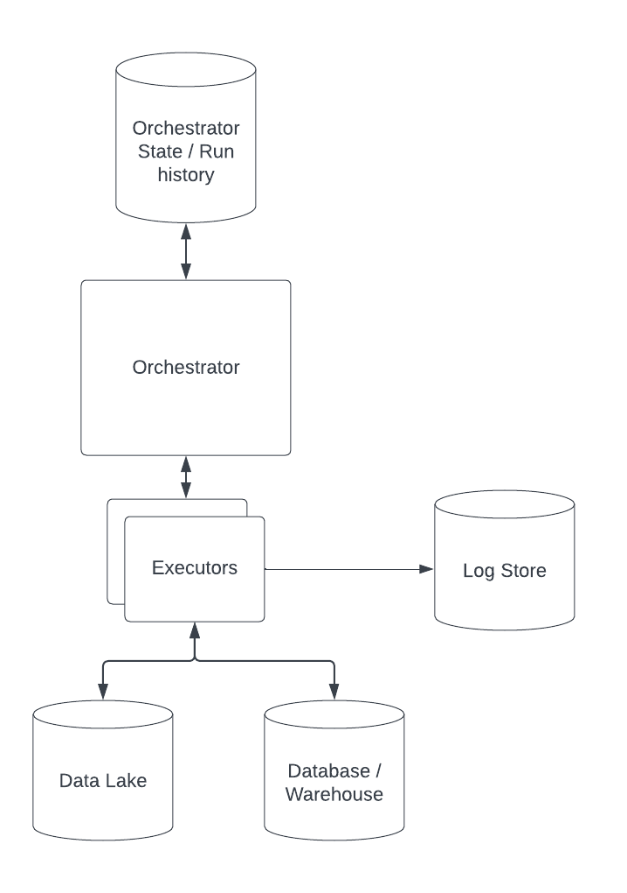

# gff2graph
A pipeline to load and transform plant genomes into graph format


## Concept

This is an example implementation of a possible data pipeline built using [dagster](https://dagster.io/). 
There are many ways to do this depending on the existing systems and requirements, but I chose dagster because I like
its mental model and wanted to use it for a while.
A lot of my thinking around how to create up-to-date, well tracked data is coming from
[this blog article](https://dagster.io/blog/software-defined-assets) by dagster's lead dev.
Alternative systems could be built on something like Airflow, CWL, Nextflow, Databricks, AWS Glue or even a simple make pipeline.

In my current job I would probably be using Databricks notebooks and PySpark to do this, but that requires a whole cloud setup.
I like the theoretical scalability of Dagster to be able to run locally as well as on a cluster.


I created a conceptual overview of a potential pipelining system as a [Lucidchart document](https://lucid.app/lucidchart/709e4fed-fe8c-4a0e-ac2b-53c2783d9019/edit?viewport_loc=-671%2C-572%2C4726%2C2341%2C0_0&invitationId=inv_a2c7e0b2-e606-46c4-ab8a-49511a162082), which I also added as a picture below:





## Considerations

My main considerations were as follows:

### Flexibility 
Any system which needs to get things perfect from the get-to is doomed to fail. Iteration and failing fast are key in my opinion. I want a system which can grow and change over time, where components can be replaced and upgraded.
It should also not be locked into any specific vendor or environment - ideally a data pipeline can run on my laptop as well as on any cloud provider.

### Scalability
To continue on from the point above, using a tool like dagster allows relatively simple migration to bigger, cloud-based systems from a simple starting project. It integrates with things like dbt, Databricks etc.

### Traceability
Initially I implemented a simple pipeline in Python, adding logging and metadata until I realised I was re-inventing the wheel.
Dagster allows orchestration and tracking of data processing, and storing of logs and metadata in a variety of ways and systems.
A simple version of such a system could simply write to log files on my laptop, a more mature system might write to S3, Logstash, or something like AWS Cloudwatch.
Using an existing framework means that the location of logs and metadata is simply a configuration choice.

### Change management
Systems change over time, especially in fast-growing companies. In my experience, having systems in which data and code 
is interdependent can cause issues with reliability and makes moving fast a nightmare.
My ideal system *tracks versions of code, data, and data schemas separately*. This allows my system to know if a data 
asset is compatible with a given piece of processing code and can apply it to the latest data if the schemas have not
changed.

### Testing
Data pipelines can be hard to test, since we might not know what we expect the data to look like as it changes over time.
Dagster provides a way to test pipelines out of the box, even though I haven't taken the time to implement tests for this example,
I believe in Test Driven Development and writing tests has saved my bacon many times as complex and growing systems change
over time.

I have also implemented testing frameworks for PySpark data pipelines before, but if there are out-of-the-box solutions I'd rather
use those.

## Drawbacks

There might be ways to use Docker containers directly with dagster such as you would in CWL for example, but I did not 
have time to properly explore this in the time I had.
As such, I had to install genometools manually and access it via Python which isn't ideal.

Dagster is also a relative newcomer to the world of pipelining tools which can be a blessing and a curse when comparing it to other systems like Airflow. I prefer the flexibility of writing things in Python over something like CWL or Nextflow which are essentially a new language to learn and rely on sometimes hard to run orchestrators. But it also means a lot of bespoke code and a lot more Python rather than using Dockefiles our of the box as is common in CWL from my experience. (Which is admittedly a few years old).

## Advantages

Software-defined data assets are a great way to specify which data should exist and materialise it when needed. Using a tool like dagster allows us to track metadata and configurations of the runs, as well as logs and errors. It also allows for convenient scheduling in a variety of ways and can run both on my laptop and large, distributed cloud systems.  
As mentioned above I enjoy the flexibility of implementation and configuration. It should be easy to deploy this system to cloud infrastructure, store logs and output files in object storage where files are under access control. It would also allow the tracking of any runs, who ran it, and when. It could store metadata around data sources and potential licenses which apply to them which is important for data governance.

Another advantage is the ability to separate the version of the processing code from the version of the data and even run multiple versions in a single pipeline to ensure backwards compatibility.


## Running the example pipeline
To run the example pipeline in this project, you can either run it once in the command line, or use the Dagit UI
to set up and trace runs and run configurations.

### Installation

**GenomeTools**


For this tool to run you will need to install genometools (e.g. `brew install genometools`) and add the location of `libgenometools.dylib`
to your `DYLD_LIBRARY_PATH` (for example by specifying an environment variable like `DYLD_LIBRARY_PATH=/opt/homebrew/lib/:$DYLD_LIBRARY_PATH`).


You will also need the Python bindings installed which can be done by cloning the genometools repo and installing the python
bindings locally.

```commandline
git clone git@github.com:genometools/genometools.git
cd genometools/gtpython
pip install setuptools==58.2.0
python setup.py install
```

**Project**

Finally, install the project dependencies using `pip install .`.


### Running the Pipeline

The pipeline can be run in two different ways: As a command line script or using dagster's dagit orchestration system in a local UI.

To run it as a script, simply call the `run_pipeline.py` script with a valid organism identifier (and optional chromosome filters) as a command line argument.
Here is an example command:

```commandline
PYTHONPATH=. DYLD_LIBRARY_PATH=/opt/homebrew/lib/:$DYLD_LIBRARY_PATH python run_pipeline.py -o arabidopsis_thaliana
```

To use the local dagster/dagit instance call: 
```commandline
PYTHONPATH=. DYLD_LIBRARY_PATH=/opt/homebrew/lib/:$DYLD_LIBRARY_PATH dagster dev -m gff2graph
```

You will have to specify the run configuration in the UI.

## Next Steps

I decided to not go further with implementing this pipeline for now as it will likely never see any real use. If this system was to become a real application, the next steps would probably entail deploying it in a more stable way in some cloud-based system.

The main to-do's I can see are:
1. Set up a proper parametrised set of run configurations for all relevant genomes
2. Implement graph ingestion
3. Dockerise components if appropriate to separate environments
4. Store metadata and logs for pipeline runs in a database with backups to object storage
5. Testing of components and assets


